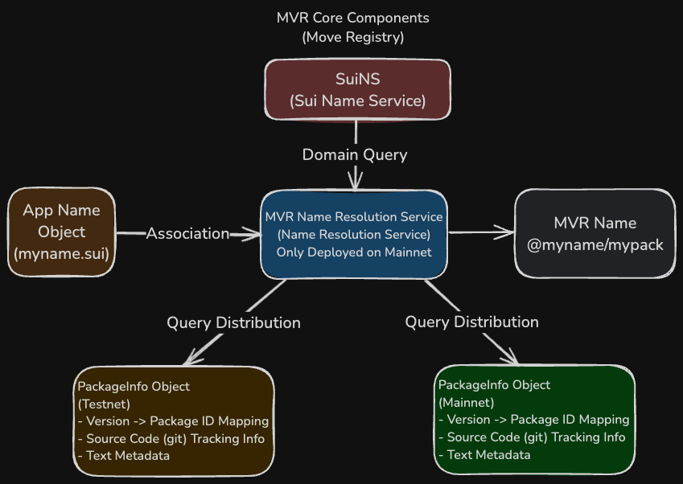

# MVR: Move Registry

In the current blockchain ecosystem, smart contract addresses are often random character strings that are difficult to memorize, causing a lot of trouble for developers and users.

MVR (Move Registry, pronounced as "mover") aims to solve this problem by providing a unified naming service for smart contract packages on the Sui blockchain.

## What is MVR?

MVR is a tool that provides a unified naming service for Move language packages in the Sui ecosystem. Through MVR, developers can reference and build smart contracts using human-readable names without worrying about package addresses on different networks.

## Main Features of MVR

- **Name References**: Reference packages and types by name in Programmable Transaction Blocks (PTBs)
- **Dependency Management**: Reference other packages by name as dependencies when developing Move contracts
- **Version Management**: Reference specific versions of packages, or use the latest version by default

## Design Principles of MVR

MVR consists of two independent core components:

1. **PackageInfo Registration System**: Deployed separately on each network, responsible for storing package metadata. Its core is the `PackageInfo` object.
2. **MVR Name Resolution Service**: Deployed on the mainnet as a unified source of truth, handling name resolution requests and linking MVR names to `PackageInfo` objects on various networks.



These two components are explained in more detail below.

### PackageInfo Objects and Registration System

The `PackageInfo` object is the basic data unit of MVR, deployed on **each network where packages need to be published** (mainnet, testnet, devnet, etc.). Developers need to create a corresponding `PackageInfo` object for their Move package on **every network** where it is deployed.

This metadata object mainly contains the following information and functions:

- **Version to Address Mapping**: Stores the mapping between the **version number** of the package and its **specific package address (Package ID)** on that particular network. This is the foundation for implementing version control and name resolution.
- **Source Code Tracking**: Records the location of the package source code for different versions (e.g., Git repository address and specific commit version/hash), facilitating code tracing and auditing by developers and users.
- **Text Metadata**: Provides human-readable metadata for the package (such as title, description, tags, etc.), intended for future MVR search engines to facilitate discovery and understanding of package functionality (this search feature is not implemented in the current version).

The `PackageInfo` object can be considered as a "local record book" maintained on **each network** for the same logical package (e.g., "my-awesome-package"), recording detailed information about the specific implementation addresses (Package ID) and related metadata for different versions of the package on that network.

### MVR Name Resolution Service (Mainnet)

To associate human-readable MVR names (such as `@myname/mypackage`) with specific `PackageInfo` objects on different networks, MVR has designed a name resolution service **deployed on the mainnet**. This service is **unified and authoritative**.

Here's how it works:

- **Based on SuiNS**: The service leverages SuiNS (Sui Name Service). The domain part of an MVR name (such as `@myname` or `myname.sui`) is first resolved through SuiNS to find its associated owner address or object on the mainnet.
- **Central Index**: The data associated with the SuiNS name (typically implemented through dynamic fields) stores a crucial **mapping**: it maps the **package name** (`mypackage`) to the **Object ID** of the corresponding **`PackageInfo` object** for that logical package on **various networks** (mainnet, testnet, etc.).
- **Query Routing**: When a tool (such as MVR CLI or SDK) needs to resolve the address of `@myname/mypackage` on `testnet`, it first queries the resolution service on the mainnet. The service returns the ID of the `PackageInfo` object for `mypackage` on `testnet`. Then, the tool uses this ID to query the `PackageInfo` object on `testnet`, ultimately obtaining the specific package address (Package ID).

Therefore, the MVR name resolution service plays the role of a **central directory or index**. It doesn't directly store package addresses but **routes** unified MVR names to the correct `PackageInfo` data records on various networks.

### MVR Names

MVR names consist of a SuiNS name and a package name, formatted as `<suins_name>/<pkg_name>`.

For example, if your SuiNS name is `myname.sui` and your package name is `mypackage`, the MVR name can be `@myname/mypackage` or `myname.sui/mypackage`.

The MVR standard also supports an optional `/<version>` format to specify which on-chain version to use. For example, `@myname/mypackage/2` indicates using version 2.

## MVR Toolchain

### 1. MVR CLI

The MVR command line tool allows developers to:

- Add dependencies for Move projects
- Build Move projects using MVR dependencies

MVR CLI can be installed via Cargo, pre-compiled binaries, or building from source code.

```bash
cargo install --locked --git https://github.com/mystenlabs/mvr --branch release mvr
```

Simple example of adding a dependency:

```bash
mvr add <package_name> --network <mainnet|testnet>
```

### 2. TypeScript SDK Plugin

MVR provides a plugin for the Sui TypeScript SDK, enabling the use of MVR names when building PTBs, offering a seamless development experience.

Before and after comparison:

**Before using MVR:**

```typescript
// Need to use complex address references
transaction.moveCall({
    target: `0xe177697e191327901637f8d2c5ffbbde8b1aaac27ec1024c4b62d1ebd1cd7430::accessories::equip`,
    arguments: [...],
    typeArguments: [
        `0x80d7de9c4a56194087e0ba0bf59492aa8e6a5ee881606226930827085ddf2332::suifren::SuiFren`
    ]
});
```

**After using MVR:**

```typescript
// Reference using human-readable names
transaction.moveCall({
    target: `@suifrens/accessories::accessories::equip`,
    arguments: [...],
    typeArguments: [
        `@suifrens/core::suifren::SuiFren`
    ]
})
```

## How to Start Using MVR

1. **Create PackageInfo Objects**: Create metadata objects for your packages
2. **Set Application Metadata**: Add descriptions, icons, documentation, and other information
3. **Associate Packages with Applications**: Link your packages with MVR names
4. **Use the Toolchain**: Start enjoying the convenience brought by MVR through CLI and SDK plugins

You can visit the [Move Registry](https://www.moveregistry.com/apps) frontend page online to directly use and manage MVR services without needing to use command line operations.

## Summary

MVR simplifies the development and use of Move smart contracts on the Sui blockchain by providing a unified naming service. It allows developers to reference contracts using human-readable names, manage dependencies and versions, thereby improving development efficiency and code readability.

## References

- [Move Registry Official Website](https://www.moveregistry.com)
- [Move Registry Official Documentation](https://docs.suins.io/move-registry)
